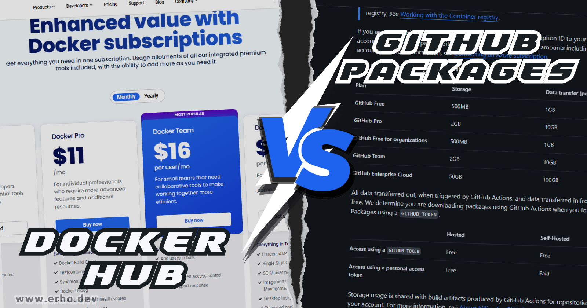
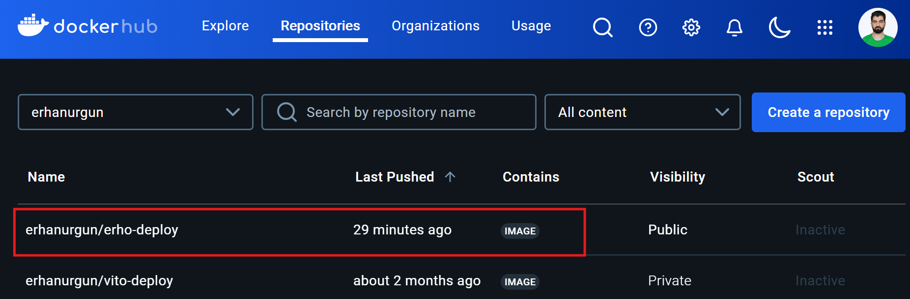
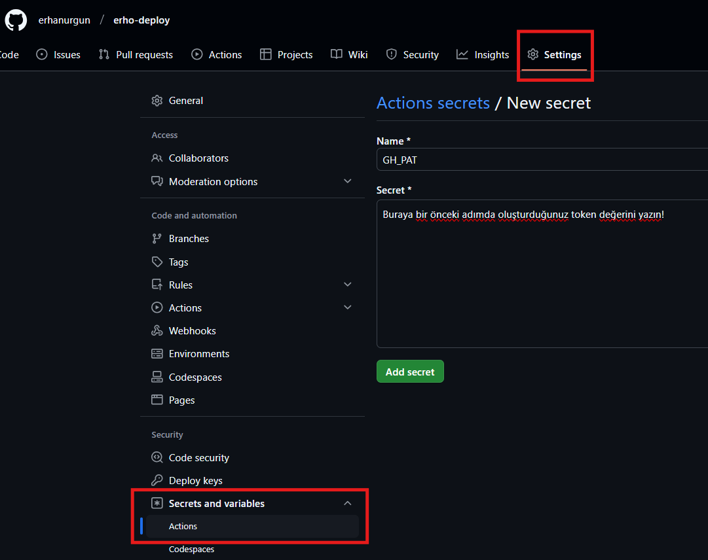
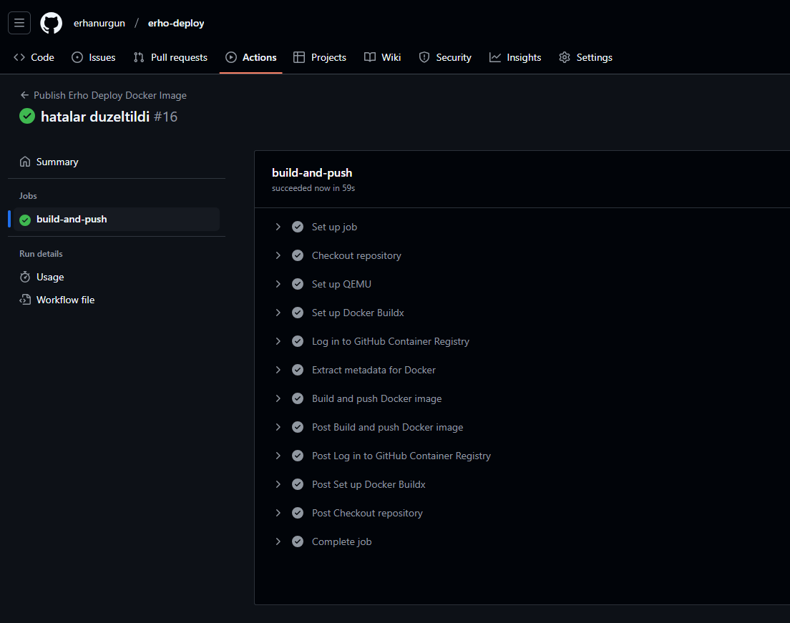
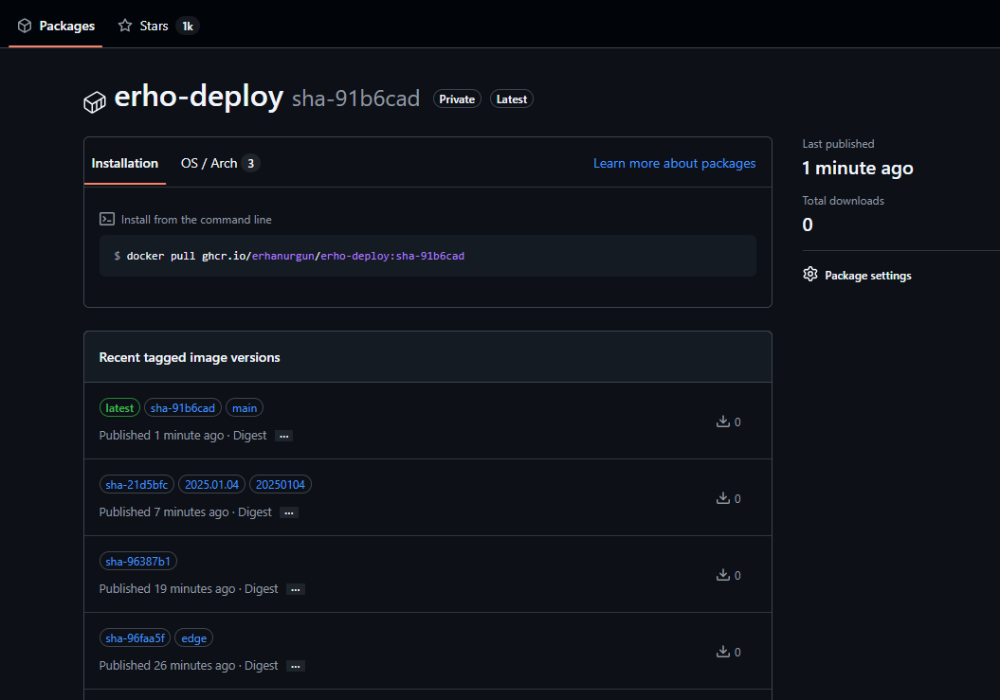

# Docker İmajları ile Çalışmak: Docker Hub ve GitHub Packages Rehberi

Selamlar! Ben Erhan. Bugün sizlerle Docker dünyasının en önemli konularından biri olan imaj yönetimi hakkında kapsamlı bir rehber hazırladım. Çayınızı kahvenizi alın, beraber keyifli bir yolculuğa çıkıyoruz…

## Neden Bu Rehberi Hazırladım?

Son zamanlarda bana en çok sorulan sorulardan biri: "**Docker Hub mu, GitHub Packages mı kullanmalıyım?**" oldu. Ben de düşündüm ki, gelin size kendi deneyimlerimden yola çıkarak detaylı bir karşılaştırma yapayım ve hangi platformun sizin için daha uygun olabileceğini birlikte keşfedelim... Hazırsanız başlayalım!

## Docker Hub ve GitHub Packages: Detaylı Karşılaştırma

### Fiyatlandırma ve Özellik Karşılaştırması

| Özellik              | Docker Hub                          | GitHub Packages            |
|----------------------|-------------------------------------|----------------------------|
| **Ücretsiz Plan**    |                                     |                            |
| Public Repo          | Sınırsız                            | Sınırsız                   |
| Private Repo         | 1 adet (2GB depolama)               | 500MB                      |
| Depolama             | 2GB / 5GB / 50GB / 500GB            | 500MB / 2GB                |
| Bandwidth            | 40 pull/sa                          | 1GB/ay                     |
| Kullanıcı            | 1 kullanıcı                         | Sınırsız                   |
| **Ücretli Planlar**  |                                     |                            |
| Pro                  | $11/ay                              | $4/ay                      |
| Team                 | $16/kullanıcı/ay                    | $4/kullanıcı/ay            |
| Business             | $24/kullanıcı/ay                    |  $21/Özel fiyatlandırma    |
| **Teknik Özellikler**|                                     |                            |
| Build Otomasyonu     | Docker Build Cloud                  | GitHub Actions ile         |
| Multi-arch Desteği   | Var                                 | Var                        |
| Vulnerability Tarama | Docker Scout ile                    | Advanced Security ile      |
| CI/CD Entegrasyonu   | Docker Build Cloud ve Testcontainers Cloud | Native GitHub Actions      |
| **Güvenlik Özellikleri**|                                  |                            |
| Kimlik Doğrulama     | Basic Auth                          | GitHub Auth                |
| Access Tokens        | Var                                 | Var                        |
| SSO Desteği          | Docker Business'da                  | GitHub Enterprise Cloud'da |
| Güvenlik Taraması    | Docker Scout ile                    | Advanced Security ile      |
| **Ekstra Özellikler**|                                     |                            |
| Community Desteği    | Çok güçlü                           | Güçlü                      |
| Official Images      | Var                                 | Yok                        |
| Paket Çeşitliliği    | Sadece Docker                       | Çoklu paket desteği        |
| Desktop Entegrasyonu | Docker Desktop                      | GitHub Desktop ile         |
| **Enterprise Özellikleri**|                                |                            |
| Team Yönetimi        | Docker Team ve Business planlarında | Organization yapısı        |
| Audit Logging        | Docker Team ve Business planlarında | GitHub Enterprise Cloud'da |
| Support              | Premium                             | Premium                    |
| Custom Domain        | Docker Business'da                  | GitHub Enterprise Cloud'da |

Bu bilgiler ilerleyen zamanlarda değişiklik gösterebilir. Güncel bilgiler ve daha fazla detay için bkz:

- Docker Hub: <https://docker.com/pricing>
- GitHub Packages: <https://github.com/pricing>

### Performans ve Kullanım Senaryoları

| Senaryo | Docker Hub | GitHub Packages | Önerilen Platform |
|---------|------------|-----------------|-------------------|
| Bireysel Geliştirici | Ücretsiz plan yeterli | Storage limiti dezavantaj | Docker Hub |
| Küçük Takım | Team plan gerekebilir | Ekonomik seçenek | GitHub Packages |
| Kurumsal Kullanım | Enterprise gerekli | GitHub Enterprise ile tam entegrasyon | Duruma göre değişir |
| Açık Kaynak | İdeal | GitHub ile entegre çalışır | İkisi de uygun |
| Özel Projeler | Private repo sınırlı | Daha esnek | GitHub Packages |
| CI/CD Odaklı | Manual config gerekir | Native entegrasyon | GitHub Packages |

### Güvenlik Özellikleri

#### Docker Hub'da Güvenlik

- Temel kimlik doğrulama
- Access token desteği
- Webhook entegrasyonu
- Otomatik build özellikleri
- İmaj tarama (ücretli planlarda)
- Docker Content Trust (DCT) ile imaj imzalama
- Otomatik güvenlik güncellemeleri
- Vulnerability Database entegrasyonu

#### GitHub Packages'ta Güvenlik

- GitHub'un güçlü güvenlik altyapısı
- Detaylı erişim kontrolü
- GHCR (GitHub Container Registry) desteği
- Bağımlılık grafiği ve güvenlik uyarıları
- Gelişmiş güvenlik özellikleri (CodeQL, gizli tarama)
- SBOM (Software Bill of Materials) desteği
- Cosign ile imaj imzalama (opsiyonel)
- Supply chain güvenliği için Sigstore entegrasyonu

**Gözlemim**: Kurumsal projelerde GitHub Packages'ın gelişmiş güvenlik özellikleri size çok daha fazla kontrol ve görünürlük sağlıyor.

## Pratik Uygulama: Base Image'dan Özel İmaj Oluşturma

Hadi şimdi teoriden pratiğe geçelim! Size gerçek bir örnek üzerinden hem Docker Hub hem de GitHub Packages kullanımını göstereceğim. Bu örnekte, Vito'nun resmi imajını ([base image](https://hub.docker.com/r/vitodeploy/vito)) kullanarak kendi özelleştirilmiş deployment imajımızı ([erho-deploy](ghcr.io/erhanurgun/erho-deploy)) oluşturacağız...

**DİPNOT:** Kişisel imajlarınızı da bu şekilde oluşturabilirsiniz. İmajın varolan bir imajdan türetilerek oluşturulması zorunlu değildir, bu sadece bir örnek!

### 1. Dockerfile Hazırlama

İlk adım olarak, projemizin kök dizininde bir `Dockerfile` oluşturalım. Base image olarak Vito'nun resmi imajını kullanacağız:

```dockerfile
# Base image olarak Vito'nun resmi imajını kullanıyoruz
FROM vitodeploy/vito:1.x

# Kendi özelleştirmelerimizi ekliyoruz
WORKDIR /var/www/html
COPY . .

# Gerekli kurulumları ve ayarları yapıyoruz
RUN composer install --no-dev --optimize-autoloader
RUN php artisan config:cache

# İmaj meta bilgilerini ekliyoruz
LABEL org.opencontainers.image.maintainer="Erhan ÜRGÜN <erho@duck.com>"
LABEL org.opencontainers.image.description="Özelleştirilmiş Vito deployment imajı"
```

### 2. Docker Hub'a İmaj Gönderme

```bash
# Kendi özelleştirilmiş imajımızı oluştur
docker build -t erhanurgun/erho-deploy:1.0.1 .

# Docker Hub'a giriş yap
docker login

# Özelleştirilmiş imajı gönder
docker push erhanurgun/erho-deploy:1.0.1
```

Bütün adımlar başarılı ise [Docker Hub](https://hub.docker.com)'da bu şekilde görüntülenecek:


### 3. GitHub Packages'a İmaj Gönderme

#### Personal Access Token (PAT) Oluşturma

GitHub Packages'ı kullanabilmek için öncelikle bir Personal Access Token oluşturmanız gerekiyor:

1. GitHub hesabınızda sağ üst köşedeki profil fotoğrafınıza tıklayın.
2. **`Settings > Developer settings > Personal access tokens > Tokens (classic)`** yolunu izleyin veya direkt olarak [buraya](https://github.com/settings/tokens/new) tıklayın.
3. "Generate new token (classic)" butonuna tıklayın.
4. Token için bir not ekleyin (örn: "Docker Package Access")
5. Aşağıdaki izinleri seçin:
   - `write:packages`
   - `read:packages`
   - `delete:packages`
   - `repo` (opsiyonel - private repo'lar için)
6. "Generate token" butonuna tıklayın.
7. Oluşturulan token'ı güvenli bir yere kaydedin (**bu token bir daha gösterilmeyecek!**)


#### GitHub Secrets Oluşturma

CI/CD süreçleri için token'ı GitHub Secrets'a eklemeniz gerekiyor:

1. GitHub'da projenizin sayfasına gidin.
2. **`Settings > Secrets and variables > Actions`** yolunu izleyin.
   Ör: `https://github.com/{kullanici-adi}/{repo-adi}/settings/secrets/actions`
3. "**New repository secret**" butonuna tıklayın.
4. **Name**: `GH_PAT` olarak girin.
5. **Value**: Yukarıda oluşturduğunuz `Personal Access Token (PAT)` değerini girin.
6. "**Add secret**" butonuna tıklayın.

Daha açıklayıcı olması adına süreci görselleştirelim:


#### İmaj Gönderme İşlemi

```bash
# Önce imajı build edelim
docker build -t erhanurgun/erho-deploy:dev .

# GitHub'a giriş yap (PowerShell)
$env:GH_PAT="<yukarıda_oluşturduğunuz_token>"
$env:GH_PAT | docker login ghcr.io -u erhanurgun --password-stdin

# Özelleştirilmiş imajı etiketle
# docker tag {username}/{repo}:{tag} ghcr.io/{username}/{repo}:{tag}
docker tag erhanurgun/erho-deploy:dev ghcr.io/erhanurgun/erho-deploy:dev

# Özelleştirilmiş imajı gönder
docker push ghcr.io/erhanurgun/erho-deploy:dev
```

**Önemli Güvenlik Notları**:

- Token'ınızı **asla** doğrudan _kodunuzda_ veya _Dockerfile_'da saklamayın.
- Token'ı güvenli bir şekilde yönetin ve düzenli olarak yenileyin.
- Minimum gerekli izinlerle token oluşturun!
- Production ortamında environment variable veya secrets kullanın.
- PowerShell komut geçmişinden `GH_PAT` değişkeninin bilgilerini silmek için: (opsiyonel)

  ```powershell
  # Tüm GH_PAT içeren komutları silmek için: (PowerShell)
  Get-History | Where-Object {$_.CommandLine -like "*GH_PAT*"} | ForEach-Object { Clear-History -Id $_.Id }
  ```

### Repository Bağlama

GitHub Packages'ta bir Docker imajını bir repository'e bağlamak, imajınızın dökümantasyonunu ve yönetimini kolaylaştırır. Bu işlem iki şekilde yapılabilir:

#### 1. Dockerfile ile Bağlama

Dockerfile'ınıza aşağıdaki satırı ekleyin:

```dockerfile
LABEL org.opencontainers.image.source https://github.com/KULLANICI_ADI/REPO_ADI
```

Örnek:

```dockerfile
LABEL org.opencontainers.image.source https://github.com/erhanurgun/erho-deploy
```

#### 2. Web Arayüzü ile Bağlama

1. GitHub Packages'ta **imajınızın sayfasına gidin**.
2. "**Connect Repository**" butonuna tıklayın.
3. Bağlamak istediğiniz **repository'i seçin**.

**Önemli Not**: Repository ve container imajının namespace'i (kullanıcı/organizasyon adı) aynı olmalıdır. Örneğin, imajınız `ghcr.io/erhanurgun/erho-deploy` ise, repository de `erhanurgun/erho-deploy` olmalıdır.

**Bağlama Avantajları**:

- README dosyası otomatik olarak görüntülenir.
- Issue ve tartışmalar imaj sayfasında görünür.
- Katkıda bulunanlar listelenir.
- Repository ile imaj arasında otomatik link oluşur.

### 4. GitHub Actions ile Otomatik Deploy

Hamal gibi her defasında manuel olarak imajı göndermek yerine, GitHub Actions ile otomatik olarak deploy edebiliriz.

- Öncelikle Dockerfile'ımızı da buna uygun olarak güncelleyelim:

```dockerfile
# Base image olarak Vito'nun belirli bir versiyonunu kullanıyoruz
ARG BASE_IMAGE_VERSION=1.x
FROM vitodeploy/vito:${BASE_IMAGE_VERSION}

# Kendi özelleştirmelerimizi ekliyoruz
WORKDIR /var/www/html
COPY . .

# Gerekli kurulumları ve ayarları yapıyoruz
RUN composer install --no-dev --optimize-autoloader
RUN php artisan config:cache

# İmaj meta bilgilerini ekliyoruz
LABEL org.opencontainers.image.maintainer="Erhan ÜRGÜN <erho@duck.com>"
LABEL org.opencontainers.image.description="Özelleştirilmiş Vito deployment imajı"
LABEL org.opencontainers.image.source https://github.com/erhanurgun/erho-deploy
LABEL org.opencontainers.image.base.name="vitodeploy/vito:${BASE_IMAGE_VERSION}"
```

- Daha sonra `.github/workflows/docker-publish.yml` dosyasını oluşturalım:

```yaml
# Workflow'un adı - GitHub Actions sekmesinde görünecek isim
name: Publish Erho Deploy Docker Image

# Workflow'u tetikleyecek olaylar
on:
  push:
    branches: ["main"]
    # Semantic versioning için tag'leri de dinle
    tags: ["v*.*.*"]
  pull_request:
    branches: ["main"]

# Tüm job'larda kullanılacak environment değişkenleri
env:
  REGISTRY: ghcr.io
  IMAGE_NAME: ${{ github.repository }}

# Çalıştırılacak iş tanımları
jobs:
  build-and-push:
    runs-on: ubuntu-latest

    # Security hardening
    permissions:
      contents: read
      packages: write
      id-token: write

    steps:
      - name: Repository'yi kontrol et
        uses: actions/checkout@v4
        with:
          fetch-depth: 0 # Tüm history'yi al (semantic versioning için)

      - name: QEMU kurulumu
        uses: docker/setup-qemu-action@v3

      - name: Docker Buildx kurulumu
        uses: docker/setup-buildx-action@v3
        with:
          buildkitd-flags: --debug # Build sorunlarını daha iyi tespit etmek için

      - name: GitHub Container Registry'e giriş
        uses: docker/login-action@v3
        with:
          registry: ${{ env.REGISTRY }}
          username: ${{ github.actor }}
          password: ${{ secrets.GH_PAT }}

      - name: Docker için meta verileri ayıklama
        id: meta
        uses: docker/metadata-action@v5
        with:
          images: ${{ env.REGISTRY }}/${{ env.IMAGE_NAME }}
          tags: |
            # Latest tag
            type=raw,value=latest,enable=${{ github.ref == format('refs/heads/{0}', 'main') }}

            # Branch bazlı tag
            type=ref,event=branch

            # PR bazlı tag
            type=ref,event=pr

            # Semantic versioning
            type=semver,pattern={{version}}
            type=semver,pattern={{major}}.{{minor}}

            # Kısa SHA
            type=sha,prefix=sha-,format=short

            # Tarih bazlı tag
            type=raw,value={{date 'YYYY.MM.DD'}}
            type=schedule,pattern={{date 'YYYYMMDD'}}

      - name: Docker image build ve push
        id: build
        uses: docker/build-push-action@v5
        with:
          context: .
          platforms: linux/amd64,linux/arm64
          push: ${{ github.event_name != 'pull_request' }}
          tags: ${{ steps.meta.outputs.tags }}
          labels: ${{ steps.meta.outputs.labels }}
          cache-from: type=gha
          cache-to: type=gha,mode=max
```

**Bu workflow şunları sağlar:**

- Base image versiyonu (1.x) merkezi olarak yönetilir.
- Build argümanları ile versiyon kontrolü sağlanır.
- GitHub Container Registry ile güvenli entegrasyon sağlanır.
- Otomatik metadata ve etiket yönetimi ile imajınız daha iyi yönetilebilir.
- Artık her **push** işleminde otomatik olarak çalışacaktır.
- Semantic versiyonlama desteğiyle (v1.0, v1.1 gibi tag'ler için) **tag** oluşturulduğunda otomatik olarak çalışacaktır.

**EK BİLGİ:** Ayrıca, **Docker Scout'u GitHub Actions ile entegre etme** için bkz: <https://docs.docker.com/scout/integrations/ci/gha>

Workflow çalıştırıldığında eğer başarılı ise **ilgili repo'nun GitHub Actions** sekmesinde bu şekilde görüntülenecek:


Bütün adımlar başarılı ise **GitHub Packages**'da bu şekilde görüntülenecek:


### Multi-Stage Build Örneği (Opsiyonel)

Şimdi `Dockerfile` dosyamını biraz daha geliştirelim... Daha optimize bir _Dockerfile_ için _multi-stage build_ kullanabilirsiniz:

- Bu işlemler bir [Laravel](https://laravel.com) projesi olan [vitodeploy/vito](https://hub.docker.com/r/vitodeploy/vito) imajı referans alınarak yapılmıştır!

```dockerfile
# Composer kurulum aşaması
FROM composer:2.6 AS composer

# Çalışma dizinini ayarla
WORKDIR /app

# Sadece composer dosyalarını kopyala
COPY composer.* ./

# Composer bağımlılıklarını kopyala ve kur
RUN composer install \
    --no-interaction \
    --no-plugins \
    --no-scripts \
    --no-dev \
    --prefer-dist \
    --optimize-autoloader

# Ana imaj aşaması
FROM vitodeploy/vito:1.x AS app

# Çalışma dizinini ayarla
WORKDIR /var/www/html

# Tüm proje dosyalarını kopyala
COPY . .

# Composer vendor klasörünü kopyala
COPY --from=composer /app/vendor ./vendor

# Storage ve cache dizinleri için izinleri ayarla
RUN chown -R www-data:www-data /var/www/html \
    && chmod -R 755 /var/www/html/storage \
    && mkdir -p /var/www/html/storage/framework/{sessions,views,cache} \
    && chmod -R 775 /var/www/html/storage/framework

# İmaj meta bilgilerini ekle
LABEL org.opencontainers.image.maintainer="Erhan ÜRGÜN <erho@duck.com>"
LABEL org.opencontainers.image.description="Özelleştirilmiş Vito deployment imajı"
LABEL org.opencontainers.image.source="https://github.com/erhanurgun/erho-deploy"
LABEL org.opencontainers.image.title="Erho Deploy"
LABEL org.opencontainers.image.version="1.0"
LABEL org.opencontainers.image.vendor="Erhan ÜRGÜN"
LABEL org.opencontainers.image.licenses="MIT"

# Sağlık kontrolü
HEALTHCHECK --interval=30s --timeout=3s --start-period=30s --retries=3 \
    CMD curl -f http://localhost/ || exit 1

# Port ayarı
EXPOSE 80

# Çalıştırma komutu
CMD ["php-fpm"]
```

_Bu multi-stage build yaklaşımı şu avantajları sağlar:_

- Daha küçük ana imaj boyutu.
- Build araçlarının ana imajda yer almaması.
- Daha güvenli bir production imajı.

## Hangi Platform Sizin İçin Doğru Seçim?

### Docker Hub'ı Tercih Edin, Eğer

- Sadece Docker imajları ile çalışıyorsanız.
- Community imajlarına sık erişiyorsanız.
- Docker Desktop kullanıyorsanız.
- Basit ve hızlı bir çözüm arıyorsanız.

### GitHub Packages'ı Tercih Edin, Eğer

- CI/CD pipeline'larınız GitHub'daysa...
- Farklı paket türleriyle çalışıyorsanız.
- GitHub'da host edilen projeleriniz varsa...
- Gelişmiş güvenlik özelliklerine ihtiyacınız varsa...

## Önerilerim

1. **Hybrid Kullanım**: Her iki platformu da kullanabilirsiniz! Ben genellikle açık kaynak projelerim için Docker Hub, kurumsal projelerim için GitHub Packages kullanıyorum.

2. **Cache Stratejisi**: GitHub Packages'ın GitHub Actions ile native entegrasyonu, build sürelerini önemli ölçüde düşürüyor.

3. **Güvenlik**: Her zaman en güncel güvenlik pratiklerini takip edin ve API tokenlarınızın güvenliğinden emin olun.

## Son Olarak

Umarım bu yazı, hangi platformun sizin ihtiyaçlarınıza daha uygun olduğunu belirlemenize yardımcı olmuştur. Ve unutmayın ki, en iyi öğrenme yöntemi deneyimlemektir... O yüzden sizlere naçizane tavsiyem; hemen bir proje oluşturun ve bu platformları deneyimleyerek anlatılanları pekiştirin!

---

Bu yazı işinize yaradı mı? Yanlış, gereksiz veya eksik bulduğunuz birşey varsa yorumlarda belirtebilirsiniz!

### **Daha fazlası için takipte kalın!**

- [https://linktr.ee/erhanurgun](https://linktr.ee/erhanurgun)
- [https://erhanurgun.tr](https://erhanurgun.tr)
- [https://erho.me](https://erho.me)
